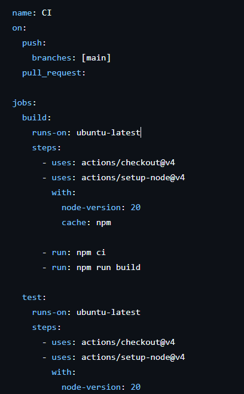
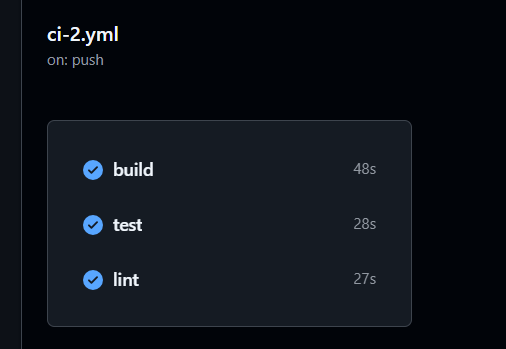
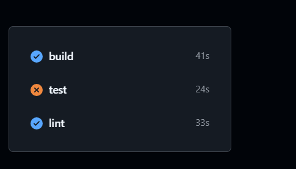
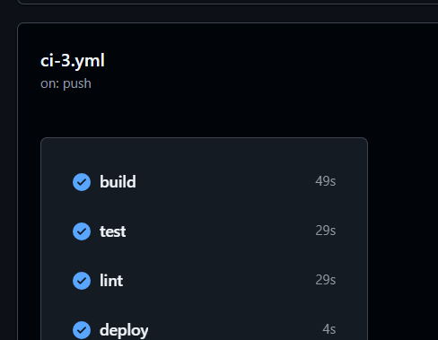

# Dokumentation 

## Aufgabe 1

Pipeline gemacht (siehe Bild unten)

## Aufgabe 2

**AI-Usage -** Can you implement ESLint and make some test-cases for Jest

Pipeline angepasst (siehe Bild unten)

Getestet ob alles läuft, auch mit Echo

Failed falls tests nicht vorhanden

## Aufgabe 3

Tests und Linter sind beide am Laufen sowie ein simulierter Deploy Job. (siehe bild unten)

